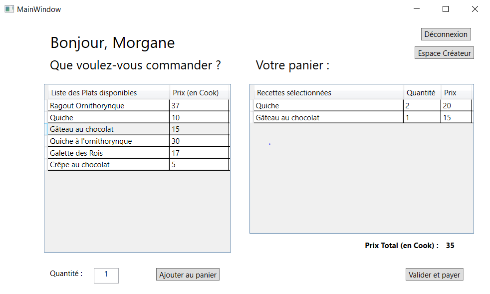
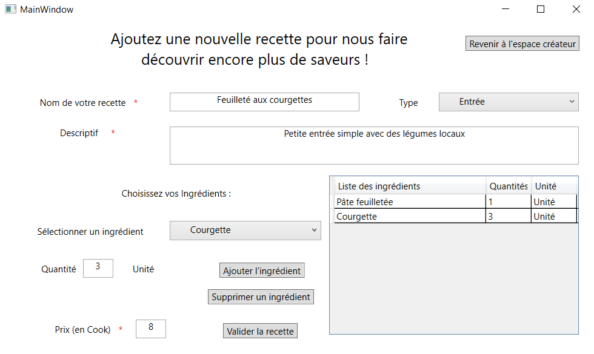
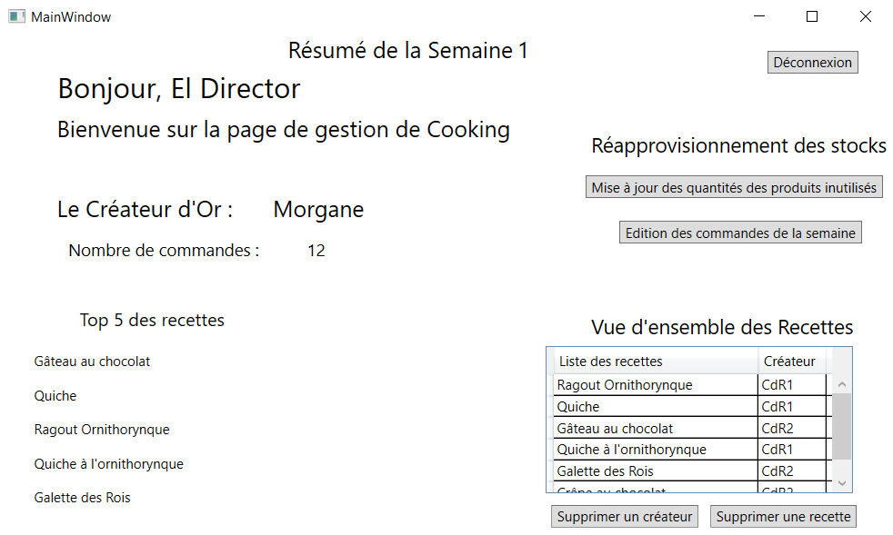

# Cooking-Database

**Date de réalisation :** Mai 2020

**Cadre du projet :** Cours "Bases de données et interopérabilité" en 3ème année à l’ESILV (1ère année du cycle ingénieur), réalisé en binôme avec Alban

**Langages utilisés :** C#, XAML, SQL

La start-up (fictive) Cooking propose des plats cuisinés que des clients peuvent commander via une interface. Les clients peuvent également avoir un profil de cuisinier et partager leurs recettes avec la communauté. La partie financière est basée sur une monnaie virtuelle (le « cook ») et permet aux clients de payer leurs plats et aux cuisiniers d’être rémunérés.

Durant ce projet, nous avons donc créé une base de données contenant les informations sur les clients, les recettes, les produits ainsi que les fournisseurs, ainsi qu’une interface ayant plusieurs fonctionnalités. 

-	Les clients peuvent :
 
S’identifier ou se créer un compte sur la plateforme

Consulter les recettes proposées

Passer une commande avec plusieurs plats et la payer (si le client ne possède pas assez de cook il ne peut pas valider la commande)

Après une commande validée, le prix de vente des recettes augmente et les stocks des produits utilisés sont décrémentés.

 <kbd></kbd>

-	Les créateurs de recette peuvent :

S’identifier ou se créer un compte sur la plateforme

Saisir une recette (nom, liste des ingrédients et quantités, description, prix de vente)

Afficher la liste de leurs recettes

 <kbd></kbd>

-	Le gestionnaire de Cooking peut :

S’identifier

Accéder au tableau de bord de la semaine (avec le top 5 des recettes commandées sur la semaine, …)

Effectuer le réapprovisionnement des produits

Supprimer une recette ou un cuisinier.

 <kbd></kbd>

